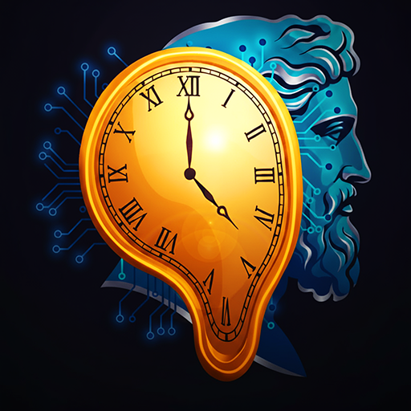

<div align="center">
  

  # Chronos

  ### AI-Powered Video Learning Assistant for Whop Creators

  **Transform passive video courses into interactive, personalized learning experiences**

  [](https://nextjs.org/)
  [](https://www.typescriptlang.org/)
  [](https://supabase.com/)
  [](https://www.anthropic.com/claude)
  [](LICENSE)

</div>

---

## 🎯 Overview

Chronos is an innovative platform designed specifically for educational creators on Whop. It leverages advanced AI technology to transform traditional video courses into interactive learning experiences, saving creators 10+ hours per week in student support while dramatically increasing course completion rates from 15% to 60%+.

### Target Market
- **Trading Education** (40%)
- **E-commerce Coaching** (20%)
- **Real Estate Training** (15%)
- **Fitness Coaching** (10%)
- **AI Training** (15%)

### Core Value Proposition
- **10+ hours/week** saved in student support
- **4x increase** in course completion rates (15% → 60%+)
- **AI-powered** chat with semantic search across video transcripts
- **Comprehensive analytics** for creator insights
- **Seamless Whop integration** with OAuth and webhooks

---

## ✨ Key Features

### 🤖 AI Chat with RAG (Retrieval-Augmented Generation)
- Semantic search across all video transcripts
- Contextual responses with timestamp citations
- Clickable video references for instant navigation
- Powered by Claude 3.5 Haiku and OpenAI embeddings

### 🎬 Video Processing Pipeline
- Bulk video upload to Supabase Storage
- Automated transcription via OpenAI Whisper
- Intelligent chunking (500-1000 word segments)
- Vector embedding generation for semantic search
- Real-time processing status updates

### 📚 Course Builder
- Drag-and-drop course organization
- Chapter and module structure
- Video assignment and ordering
- Drip-feeding settings (coming soon)
- File attachments support (coming soon)

### 📊 Creator Analytics Dashboard
- Video performance metrics with interactive charts
- Student engagement tracking
- Watch time and completion rates
- AI chat usage analytics
- Revenue and conversion insights

### 🎫 Usage Limits & Tier Management
- Tier-based rate limiting
- Storage and AI credit quotas
- Usage monitoring dashboard
- Automatic enforcement per Whop plan

### 🔗 Whop Integration
- OAuth authentication
- Membership validation and sync
- Webhook handlers for real-time updates
- Seamless billing integration

---

## 🛠️ Tech Stack

### Frontend
- **Framework:** Next.js 14 (App Router)
- **Language:** TypeScript
- **UI Library:** Frosted UI (Whop's design system)
- **Styling:** Tailwind CSS
- **Charts:** Recharts
- **Animation:** Framer Motion (optional)

### Backend
- **Database:** Supabase PostgreSQL with pgvector
- **Authentication:** Whop OAuth
- **Storage:** Supabase Storage
- **Jobs:** Inngest (background processing)
- **Cache:** Vercel KV (Redis)
- **Rate Limiting:** Upstash

### AI & ML
- **Chat:** Claude 3.5 Haiku (Anthropic)
- **Transcription:** OpenAI Whisper
- **Embeddings:** OpenAI text-embedding-ada-002
- **Vector Search:** pgvector (PostgreSQL extension)

### Infrastructure
- **Deployment:** Vercel
- **Monitoring:** Sentry
- **Analytics:** Vercel Analytics
- **CI/CD:** GitHub Actions (coming soon)

---

## 🚀 Getting Started

### Prerequisites
- Node.js 18+ and npm/pnpm
- Supabase account and project
- Whop developer account and app
- OpenAI API key
- Anthropic API key

### Installation

1. **Clone the repository**
   ```bash
   git clone https://github.com/Agentic-Person/whop-chronos.git
   cd chronos
   ```

2. **Install dependencies**
   ```bash
   npm install
   # or
   pnpm install
   ```

3. **Set up environment variables**
   ```bash
   cp .env.example .env.local
   ```

   Fill in the following required variables:
   ```env
   # Whop
   WHOP_API_KEY=your_whop_api_key
   WHOP_CLIENT_ID=your_client_id
   WHOP_CLIENT_SECRET=your_client_secret
   WHOP_WEBHOOK_SECRET=your_webhook_secret

   # Supabase
   NEXT_PUBLIC_SUPABASE_URL=your_supabase_url
   NEXT_PUBLIC_SUPABASE_ANON_KEY=your_anon_key
   SUPABASE_SERVICE_ROLE_KEY=your_service_role_key

   # AI APIs
   ANTHROPIC_API_KEY=your_anthropic_key
   OPENAI_API_KEY=your_openai_key

   # Infrastructure
   VERCEL_KV_URL=your_kv_url
   UPSTASH_REDIS_REST_URL=your_redis_url
   UPSTASH_REDIS_REST_TOKEN=your_redis_token
   ```

4. **Set up Supabase**
   ```bash
   # Initialize Supabase CLI (if not already done)
   npx supabase init

   # Link to your Supabase project
   npx supabase link --project-ref your-project-ref

   # Run migrations
   npx supabase db push

   # Seed the database (optional)
   npm run db:seed
   ```

5. **Configure Whop App**
   - Go to [Whop Developer Dashboard](https://whop.com/dashboard/developer/)
   - Create a new app or select existing
   - Set the following paths:
     - **Base URL:** Your deployment domain (or `http://localhost:3007` for dev)
     - **App path:** `/experiences/[experienceId]`
     - **Dashboard path:** `/dashboard/creator/overview`
     - **Discover path:** `/discover`
   - Copy your API keys and secrets to `.env.local`

6. **Run the development server**
   ```bash
   npm run dev
   ```

   Open [http://localhost:3007](http://localhost:3007) in your browser.

---

## 📁 Project Structure

```
chronos/
├── app/                          # Next.js 14 App Router
│   ├── api/                      # API routes
│   │   ├── whop/                 # OAuth + webhooks
│   │   ├── video/                # Upload + processing
│   │   ├── chat/                 # RAG chat endpoint
│   │   ├── courses/              # Course management
│   │   └── analytics/            # Analytics queries
│   ├── dashboard/
│   │   └── creator/              # Creator dashboard pages
│   │       ├── overview/         # Main analytics dashboard
│   │       ├── courses/          # Course builder & video management
│   │       ├── analytics/        # Deep dive analytics
│   │       ├── usage/            # Tier limits & billing
│   │       └── chat/             # AI chat interface
│   └── page.tsx                  # Landing page
├── components/
│   ├── video/                    # Video upload, player, list
│   ├── chat/                     # Chat interface components
│   ├── courses/                  # Course builder components
│   ├── analytics/                # Charts & metrics widgets
│   ├── landing/                  # Landing page components
│   ├── layout/                   # Navigation & layouts
│   └── ui/                       # Frosted UI + custom components
├── lib/
│   ├── whop/                     # Whop SDK integration
│   ├── rag/                      # RAG chat + vector search
│   ├── video/                    # Video processing pipeline
│   ├── analytics/                # Analytics calculation logic
│   └── db/                       # Supabase query helpers
├── docs/
│   ├── dashboard-overhaul/       # Dashboard redesign docs (Wave 1 complete)
│   ├── IMPLEMENTATION_PLAN.md    # Master implementation blueprint
│   └── OLD_PROJECT_AUDIT.md      # Lessons learned from v1
├── supabase/
│   └── migrations/               # Database migrations
├── scripts/
│   ├── seed-database.ts          # Seed test data
│   ├── test-video-pipeline.ts    # Test video processing
│   ├── test-analytics-dashboard.ts  # Test analytics
│   └── test-all-integrations.ts  # Run all tests
├── tests/
│   └── playwright/               # Playwright E2E tests (48 tests)
├── public/
│   └── images/                   # Brand assets
├── TESTING.md                    # Comprehensive testing guide
├── CLAUDE.md                     # AI assistant project context
└── README.md                     # This file
```

---

## 🧪 Testing

### Integration Tests

Run all integration tests:
```bash
npm run test:all
```

Run specific test suites:
```bash
# Test video processing pipeline
npm run test:video-pipeline

# Test analytics dashboard
npm run test:analytics
```

### Playwright E2E Tests

We use Playwright for end-to-end testing across multiple browsers.

```bash
# Install Playwright browsers (first time only)
npx playwright install

# Run all Playwright tests
npx playwright test

# Run tests in UI mode (interactive)
npx playwright test --ui

# Run specific test file
npx playwright test tests/playwright/dashboard-navigation.spec.ts

# Run tests in specific browser
npx playwright test --project=chromium
npx playwright test --project=firefox
npx playwright test --project=webkit
```

**Test Coverage:**
- ✅ Dashboard navigation (4 tests)
- ✅ Analytics components (3 tests)
- ✅ Responsive design (mobile, tablet, desktop)
- ✅ Multi-browser testing (Chrome, Firefox, Safari)
- ✅ 48 total tests written

See [TESTING.md](TESTING.md) for comprehensive testing documentation.

---

## 📊 Database Schema

### Core Tables

1. **creators** - Whop company profiles and settings
2. **students** - Whop user profiles and preferences
3. **videos** - Video metadata, URLs, transcripts, processing status
4. **video_chunks** - Transcript chunks with vector embeddings (1536 dimensions)
5. **courses** - Course metadata and structure
6. **course_modules** - Course organization with video assignments
7. **chat_sessions** - AI chat conversation sessions
8. **chat_messages** - Individual chat messages with video references
9. **video_analytics** - Video performance metrics by date
10. **usage_metrics** - Creator storage and AI credit usage tracking

### Vector Search

Chronos uses pgvector for semantic search:

```sql
-- Enable pgvector extension
CREATE EXTENSION vector;

-- Vector similarity search index
CREATE INDEX ON video_chunks USING ivfflat (embedding vector_cosine_ops);
```

---

## 🔄 Development Workflow

### Parallel Agent Execution

Chronos follows a parallel agent development pattern for maximum efficiency:

1. **Orchestrator** manages overall project coordination
2. **Specialized agents** work on independent features simultaneously
3. **3-5x faster** development vs sequential workflow
4. **Better code isolation** with clear module boundaries

See [docs/dashboard-overhaul/README.md](docs/dashboard-overhaul/README.md) for details.

### Git Commit Convention

All commits follow this format:

```
type(scope): description

[optional body]

Assisted by Jimmy Solutions Developer at Agentic Personnel LLC <Jimmy@AgenticPersonnel.com>
```

**Types:** `feat`, `fix`, `docs`, `style`, `refactor`, `test`, `chore`, `perf`, `ui`, `ci`, `build`

---

## 🚢 Deployment

### Vercel Deployment (Recommended)

1. **Push to GitHub**
   ```bash
   git push origin main
   ```

2. **Import to Vercel**
   - Go to [Vercel](https://vercel.com/new)
   - Import your GitHub repository
   - Configure environment variables from `.env.local`
   - Deploy

3. **Update Whop App Settings**
   - Update "Base URL" to your Vercel domain
   - Update webhook callback URLs if needed

### Supabase Setup

Ensure your Supabase project is configured:
- Database migrations are applied
- Row Level Security (RLS) policies are enabled
- Storage buckets are created (`videos`, `thumbnails`)
- Edge Functions are deployed (if any)

### Environment Variables

Set these in your Vercel project:
- All variables from `.env.local`
- `NODE_ENV=production`
- Optional: `SENTRY_DSN` for error tracking

---

## 📚 Documentation

### Project Documentation
- **[CLAUDE.md](CLAUDE.md)** - AI assistant project context and guidelines
- **[TESTING.md](TESTING.md)** - Comprehensive testing guide
- **[IMPLEMENTATION_PLAN.md](docs/IMPLEMENTATION_PLAN.md)** - Master implementation blueprint

### Dashboard Overhaul (Wave 1 Complete)
- **[Master Plan](docs/dashboard-overhaul/CHRONOS_DASHBOARD_OVERHAUL.md)** - Dashboard redesign overview
- **[Task Tracker](docs/dashboard-overhaul/TASK_TRACKER.md)** - Real-time progress tracking
- **[README](docs/dashboard-overhaul/README.md)** - Documentation guide

### External Resources
- [Whop Developer Docs](https://docs.whop.com)
- [Frosted UI Storybook](https://storybook.whop.dev)
- [Supabase Docs](https://supabase.com/docs)
- [Claude API Docs](https://docs.anthropic.com)
- [Next.js Docs](https://nextjs.org/docs)

---

## 🎨 Design System

Chronos uses **Frosted UI** - Whop's official design system built on Radix UI.

- **Package:** `frosted-ui@0.0.1-canary.85`
- **Storybook:** [storybook.whop.dev](https://storybook.whop.dev)
- **GitHub:** [github.com/whopio/frosted-ui](https://github.com/whopio/frosted-ui)

### Design Patterns
- Frosted UI components exclusively (no custom Tailwind buttons/forms)
- Design tokens for colors (`--gray-1` through `--gray-12`, `--accent-*`)
- Responsive breakpoints: 375px (mobile), 768px (tablet), 1440px (desktop)
- Consistent loading states with Skeleton/Spinner
- Helpful empty states with CTAs

---

## 🤝 Contributing

We welcome contributions! Here's how to get started:

1. **Fork the repository**
2. **Create a feature branch**
   ```bash
   git checkout -b feature/your-feature-name
   ```
3. **Make your changes**
4. **Test thoroughly**
   ```bash
   npm run test:all
   npx playwright test
   ```
5. **Commit with proper format**
   ```bash
   git commit -m "feat(scope): your feature description

   Assisted by Jimmy Solutions Developer at Agentic Personnel LLC <Jimmy@AgenticPersonnel.com>"
   ```
6. **Push and create a Pull Request**

### Code Style
- TypeScript strict mode enabled
- ESLint + Prettier (Biome) for linting
- Follow existing patterns and conventions
- Write tests for new features

---

## 📈 Roadmap

### Phase 1: Creator Dashboard (Current - Wave 1 Complete ✅)
- [x] Navigation structure (5 tabs)
- [x] Analytics components with Frosted UI
- [x] Playwright test infrastructure
- [ ] Wave 2: Polish pages (Overview, Courses, Analytics, Usage, Chat)
- [ ] Wave 3: Testing & accessibility audit

### Phase 2: Student Dashboard (Next)
- [ ] Student course catalog
- [ ] Video player with AI chat
- [ ] Progress tracking
- [ ] Achievements and gamification

### Phase 3: Advanced Features
- [ ] AI quiz generation
- [ ] Learning calendar
- [ ] Study buddy matching
- [ ] Mobile app (React Native)

### Phase 4: Enterprise Features
- [ ] White-label solutions
- [ ] Advanced analytics & reporting
- [ ] LMS integrations
- [ ] API for third-party developers

---

## 🔒 Security

### Best Practices
- All API routes validate Whop OAuth tokens
- Row Level Security (RLS) enabled on all Supabase tables
- Rate limiting on all public endpoints (100 req/min per user)
- SQL injection prevention via parameterized queries
- Secrets stored in environment variables only
- Webhook signature verification

### Reporting Security Issues
Please report security vulnerabilities to: **Jimmy@AgenticPersonnel.com**

---

## 📄 License

This project is licensed under the MIT License - see the [LICENSE](LICENSE) file for details.

---

## 💼 About

**Chronos** is developed by **Agentic Personnel LLC**, a software development agency specializing in AI-powered educational technology and Whop platform integrations.

### Contact & Support

- **Email:** Jimmy@AgenticPersonnel.com
- **GitHub:** [@Agentic-Person](https://github.com/Agentic-Person)
- **Whop Marketplace:** Coming Soon

### Acknowledgments

- **Whop** for the excellent platform and Frosted UI design system
- **Anthropic** for Claude 3.5 Haiku AI capabilities
- **OpenAI** for Whisper transcription and embeddings
- **Supabase** for the amazing backend infrastructure
- **Vercel** for seamless deployment and hosting

---

<div align="center">

  **Built with ❤️ for Educational Creators**

  Made by [Agentic Personnel LLC](https://github.com/Agentic-Person)

  ⭐ Star this repo if you find it helpful!

</div>
