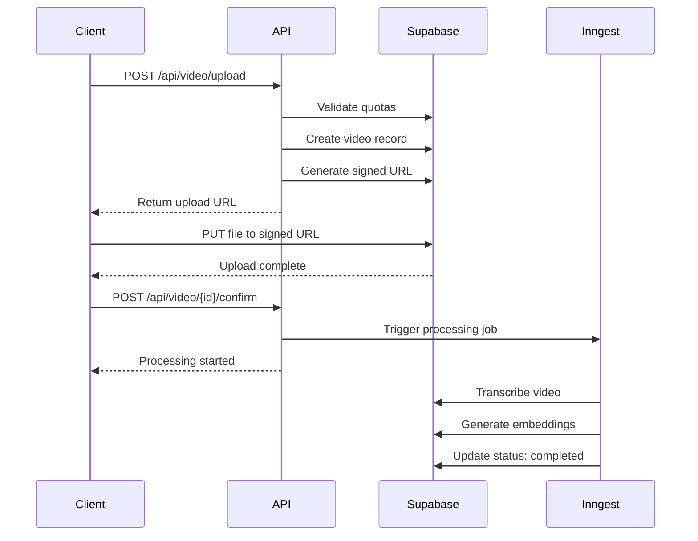

# Video API Documentation

Complete API reference for video upload, management, and storage operations in Chronos.

## Table of Contents

- [Overview](#overview)
- [Authentication](#authentication)
- [Endpoints](#endpoints)
  - [Upload Video](#upload-video)
  - [List Videos](#list-videos)
  - [Get Video Details](#get-video-details)
  - [Update Video](#update-video)
  - [Delete Video](#delete-video)
- [Upload Flow](#upload-flow)
- [Error Handling](#error-handling)
- [Rate Limits](#rate-limits)

---

## Overview

The Video API provides endpoints for:
- **Upload Management**: Secure signed URL generation for direct-to-storage uploads
- **Video Listing**: Paginated, filtered video lists with status tracking
- **Video Details**: Detailed information including processing status
- **Video Updates**: Metadata editing (title, description)
- **Video Deletion**: Soft and hard deletion with storage cleanup

All video files are stored in Supabase Storage with tier-based quotas.

---

## Authentication

All endpoints require authentication via Whop OAuth tokens.

**Header:**
```
Authorization: Bearer <whop_oauth_token>
```

**Creator ID** must be extracted from the authenticated session.

---

## Endpoints

### Upload Video

Generate a signed upload URL and create video record.

**Endpoint:** `POST /api/video/upload`

**Request Body:**
```json
{
  "filename": "course-intro.mp4",
  "fileSize": 157286400,
  "mimeType": "video/mp4",
  "title": "Course Introduction",
  "description": "Welcome to the trading course",
  "creatorId": "uuid-creator-id"
}
```

**Success Response (200 OK):**
```json
{
  "success": true,
  "video": {
    "id": "uuid-video-id",
    "title": "Course Introduction",
    "status": "uploading"
  },
  "upload": {
    "url": "https://dddttlnrkwaddzjvkacp.supabase.co/storage/v1/...",
    "token": "upload-token-xyz",
    "storagePath": "creator-id/video-id/1699123456789.mp4",
    "method": "PUT",
    "headers": {
      "Content-Type": "video/mp4"
    }
  },
  "quotaInfo": {
    "storageUsed": 1073741824,
    "storageLimit": 10737418240,
    "videosCount": 12,
    "videosLimit": 50,
    "monthlyUploads": 5,
    "monthlyLimit": 20
  },
  "warnings": [],
  "instructions": {
    "message": "Upload the file to the provided URL using PUT request with the file as body",
    "example": "fetch(upload.url, { method: 'PUT', body: file, headers: upload.headers })",
    "nextStep": "After successful upload, call POST /api/video/{id}/confirm to start processing"
  }
}
```

**Error Response (403 Forbidden - Quota Exceeded):**
```json
{
  "error": "Upload validation failed",
  "errors": [
    "Storage quota exceeded. Using 9.5 GB + 150 MB = 9.65 GB exceeds basic tier limit of 10 GB",
    "Monthly upload limit reached: 20/20 for basic tier"
  ],
  "quotaInfo": {
    "storageUsed": 10200547328,
    "storageLimit": 10737418240,
    "videosCount": 48,
    "videosLimit": 50,
    "monthlyUploads": 20,
    "monthlyLimit": 20
  }
}
```

**Upload Flow Example (JavaScript):**
```javascript
// Step 1: Request upload URL
const response = await fetch('/api/video/upload', {
  method: 'POST',
  headers: {
    'Content-Type': 'application/json',
    'Authorization': `Bearer ${whopToken}`
  },
  body: JSON.stringify({
    filename: file.name,
    fileSize: file.size,
    mimeType: file.type,
    title: 'My Video Title',
    creatorId: creatorId
  })
});

const { upload, video } = await response.json();

// Step 2: Upload file directly to Supabase Storage
await fetch(upload.url, {
  method: 'PUT',
  body: file,
  headers: upload.headers
});

// Step 3: Confirm upload (triggers processing)
await fetch(`/api/video/${video.id}/confirm`, {
  method: 'POST',
  headers: { 'Authorization': `Bearer ${whopToken}` }
});
```

---

### List Videos

Get paginated list of videos with filtering.

**Endpoint:** `GET /api/video/list`

**Query Parameters:**
| Parameter | Type | Required | Default | Description |
|-----------|------|----------|---------|-------------|
| `creatorId` | string | Yes | - | Creator UUID |
| `status` | string\|string[] | No | - | Filter by status (pending, uploading, transcribing, processing, embedding, completed, failed) |
| `dateFrom` | string | No | - | ISO date (e.g., 2024-01-01) |
| `dateTo` | string | No | - | ISO date |
| `search` | string | No | - | Search in title/description |
| `page` | number | No | 1 | Page number |
| `limit` | number | No | 20 | Results per page (max 100) |
| `sortBy` | string | No | created_at | Sort field (created_at, updated_at, title) |
| `sortOrder` | string | No | desc | asc or desc |

**Example Request:**
```
GET /api/video/list?creatorId=uuid-creator&status=completed&status=processing&page=1&limit=20&search=trading
```

**Success Response (200 OK):**
```json
{
  "success": true,
  "data": [
    {
      "id": "uuid-video-1",
      "title": "Advanced Trading Strategies",
      "description": "Learn advanced techniques",
      "status": "completed",
      "duration": 1800,
      "fileSize": 157286400,
      "thumbnailUrl": "https://...",
      "createdAt": "2024-01-15T10:30:00Z",
      "updatedAt": "2024-01-15T11:00:00Z",
      "processingStartedAt": "2024-01-15T10:35:00Z",
      "processingCompletedAt": "2024-01-15T11:00:00Z",
      "errorMessage": null,
      "metadata": {},
      "progress": {
        "percentage": 100,
        "stage": "Ready"
      }
    }
  ],
  "pagination": {
    "page": 1,
    "limit": 20,
    "total": 45,
    "totalPages": 3,
    "hasNextPage": true,
    "hasPreviousPage": false
  },
  "filters": {
    "status": ["completed", "processing"],
    "search": "trading",
    "sortBy": "created_at",
    "sortOrder": "desc"
  }
}
```

---

### Get Video Details

Retrieve detailed information about a specific video.

**Endpoint:** `GET /api/video/[id]`

**Query Parameters:**
| Parameter | Type | Required | Default | Description |
|-----------|------|----------|---------|-------------|
| `includeDownloadUrl` | boolean | No | false | Generate signed download URL |

**Example Request:**
```
GET /api/video/uuid-video-123?includeDownloadUrl=true
```

**Success Response (200 OK):**
```json
{
  "success": true,
  "data": {
    "id": "uuid-video-123",
    "creatorId": "uuid-creator",
    "title": "Trading Basics",
    "description": "Introduction to trading",
    "status": "completed",
    "duration": 1200,
    "fileSize": 104857600,
    "thumbnailUrl": "https://...",
    "downloadUrl": "https://dddttlnrkwaddzjvkacp.supabase.co/storage/v1/...",
    "transcript": "Welcome to this trading course...",
    "transcriptLanguage": "en",
    "chunksCount": 15,
    "createdAt": "2024-01-10T09:00:00Z",
    "updatedAt": "2024-01-10T09:30:00Z",
    "processingStartedAt": "2024-01-10T09:05:00Z",
    "processingCompletedAt": "2024-01-10T09:30:00Z",
    "errorMessage": null,
    "metadata": {
      "original_filename": "trading-basics.mp4",
      "mime_type": "video/mp4"
    }
  }
}
```

**Error Response (404 Not Found):**
```json
{
  "error": "Video not found"
}
```

---

### Update Video

Update video metadata (title, description).

**Endpoint:** `PATCH /api/video/[id]`

**Request Body:**
```json
{
  "title": "Updated Title",
  "description": "Updated description"
}
```

**Success Response (200 OK):**
```json
{
  "success": true,
  "message": "Video updated successfully",
  "data": {
    "id": "uuid-video-123",
    "title": "Updated Title",
    "description": "Updated description",
    "updatedAt": "2024-01-15T14:20:00Z"
  }
}
```

---

### Delete Video

Delete a video (soft or hard delete).

**Endpoint:** `DELETE /api/video/[id]`

**Query Parameters:**
| Parameter | Type | Required | Default | Description |
|-----------|------|----------|---------|-------------|
| `hard` | boolean | No | false | Permanent deletion (removes from storage) |

**Soft Delete (Default):**
```
DELETE /api/video/uuid-video-123
```

**Hard Delete:**
```
DELETE /api/video/uuid-video-123?hard=true
```

**Success Response (200 OK):**
```json
{
  "success": true,
  "message": "Video deleted successfully"
}
```

**Hard Delete Response:**
```json
{
  "success": true,
  "message": "Video permanently deleted"
}
```

---

## Upload Flow

### Complete Upload Process



### Processing Stages

1. **pending** (0%) - Video record created, waiting for upload
2. **uploading** (10%) - File upload in progress
3. **transcribing** (30%) - Audio extraction and transcription
4. **processing** (50%) - Transcript chunking
5. **embedding** (70%) - Vector embedding generation
6. **completed** (100%) - Ready for RAG chat
7. **failed** (0%) - Processing error occurred

---

## Error Handling

### Error Response Format

```json
{
  "error": "Error type",
  "message": "Detailed error message",
  "errors": ["Specific error 1", "Specific error 2"]
}
```

### Common HTTP Status Codes

| Code | Meaning | Common Causes |
|------|---------|---------------|
| 400 | Bad Request | Missing required fields, invalid data |
| 403 | Forbidden | Quota exceeded, permission denied |
| 404 | Not Found | Video does not exist |
| 500 | Internal Server Error | Database error, storage error |

---

## Rate Limits

### Tier-Based Quotas

| Tier | Max Storage | Max File Size | Max Videos | Monthly Uploads |
|------|-------------|---------------|------------|-----------------|
| Basic | 10 GB | 500 MB | 50 | 20 |
| Pro | 100 GB | 2 GB | 500 | 100 |
| Enterprise | 1 TB | 5 GB | Unlimited | Unlimited |

### Allowed Video Formats

- **Basic**: mp4, mov, avi, webm
- **Pro**: mp4, mov, avi, webm, mkv, flv
- **Enterprise**: mp4, mov, avi, webm, mkv, flv, m4v, wmv

---

## TypeScript Types

```typescript
// Video status
type VideoStatus =
  | 'pending'
  | 'uploading'
  | 'transcribing'
  | 'processing'
  | 'embedding'
  | 'completed'
  | 'failed';

// Upload request
interface UploadRequest {
  filename: string;
  fileSize: number;
  mimeType: string;
  title?: string;
  description?: string;
  creatorId: string;
}

// Video response
interface Video {
  id: string;
  creatorId: string;
  title: string;
  description: string | null;
  status: VideoStatus;
  duration: number | null;
  fileSize: number | null;
  thumbnailUrl: string | null;
  downloadUrl?: string | null;
  transcript: string | null;
  transcriptLanguage: string | null;
  chunksCount: number;
  createdAt: string;
  updatedAt: string;
  processingStartedAt: string | null;
  processingCompletedAt: string | null;
  errorMessage: string | null;
  metadata: Record<string, any>;
}
```

---

## Examples

### React Upload Component

```tsx
import { useState } from 'react';

export function VideoUploader({ creatorId }: { creatorId: string }) {
  const [uploading, setUploading] = useState(false);
  const [progress, setProgress] = useState(0);

  const handleUpload = async (file: File) => {
    setUploading(true);
    setProgress(0);

    try {
      // Step 1: Get upload URL
      const initRes = await fetch('/api/video/upload', {
        method: 'POST',
        headers: { 'Content-Type': 'application/json' },
        body: JSON.stringify({
          filename: file.name,
          fileSize: file.size,
          mimeType: file.type,
          creatorId,
        }),
      });

      const { upload, video } = await initRes.json();
      setProgress(25);

      // Step 2: Upload file
      await fetch(upload.url, {
        method: 'PUT',
        body: file,
        headers: upload.headers,
      });
      setProgress(75);

      // Step 3: Confirm and start processing
      await fetch(`/api/video/${video.id}/confirm`, {
        method: 'POST',
      });
      setProgress(100);

      alert('Video uploaded successfully!');
    } catch (error) {
      console.error('Upload failed:', error);
      alert('Upload failed');
    } finally {
      setUploading(false);
    }
  };

  return (
    <div>
      <input
        type="file"
        accept="video/*"
        onChange={(e) => e.target.files?.[0] && handleUpload(e.target.files[0])}
        disabled={uploading}
      />
      {uploading && <progress value={progress} max={100} />}
    </div>
  );
}
```

---

## Support

For issues or questions:
- **Documentation**: `/docs/API_VIDEO_ENDPOINTS.md`
- **Storage Setup**: Run `supabase/setup-storage.sql`
- **GitHub Issues**: [Project Repository]
