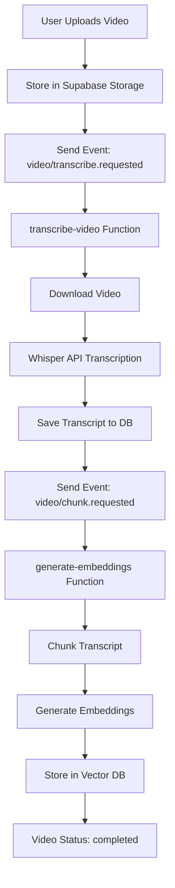
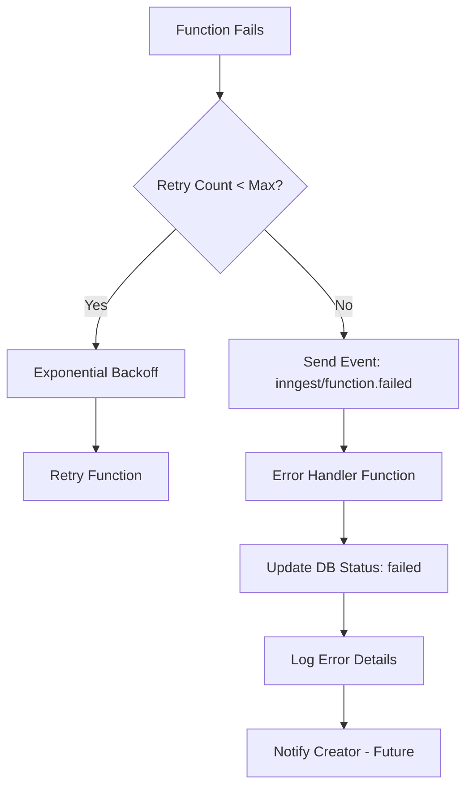

# Inngest Setup & Development Guide

## Overview

Inngest is configured for background job processing in Chronos. It handles:
- Video transcription (OpenAI Whisper)
- Transcript chunking
- Vector embedding generation (OpenAI)
- Error handling and retries
- Usage metrics tracking

## Architecture

```
Video Upload → Inngest Event → Background Jobs → Database Update
                    ↓
        1. Transcribe (Whisper)
        2. Chunk Transcript
        3. Generate Embeddings
        4. Store in Vector DB
```

## Configuration Status

✅ **Inngest Client**: Configured (`inngest/client.ts`)
✅ **Webhook Endpoint**: `/api/inngest/route.ts`
✅ **Job Definitions**: 5 functions registered
✅ **Event Types**: TypeScript interfaces defined
✅ **Error Handlers**: Automatic retry and failure handling

## Registered Functions

### 1. `transcribe-video`
- **Event**: `video/transcribe.requested`
- **Purpose**: Transcribe video audio using OpenAI Whisper
- **Retries**: 3 attempts with exponential backoff
- **Rate Limit**: 10 concurrent per creator
- **Steps**:
  1. Update video status → "transcribing"
  2. Download video from Supabase Storage
  3. Transcribe with Whisper API
  4. Save transcript to database
  5. Update usage metrics
  6. Trigger chunking event

### 2. `transcribe-video-error`
- **Event**: `inngest/function.failed` (for transcribe-video)
- **Purpose**: Handle transcription failures gracefully
- **Actions**:
  - Update video status → "failed"
  - Log error details
  - Send failure notification (future)

### 3. `generate-embeddings`
- **Event**: `video/transcription.completed`
- **Purpose**: Generate vector embeddings from transcript chunks
- **Retries**: 2 attempts
- **Steps**:
  1. Validate video and check if embeddings exist
  2. Update status → "processing"
  3. Chunk transcript (500-1000 words, 100 word overlap)
  4. Store chunks in database
  5. Update status → "embedding"
  6. Generate embeddings in batches (20 chunks)
  7. Update chunks with embeddings
  8. Track usage metrics
  9. Update status → "completed"

### 4. `handle-embedding-failure`
- **Event**: `inngest/function.failed` (for generate-embeddings)
- **Purpose**: Handle embedding generation failures
- **Actions**:
  - Update video status → "failed"
  - Log error message
  - Prepare notification (future)

### 5. `batch-reprocess-embeddings`
- **Event**: `video/embeddings.batch-reprocess`
- **Purpose**: Reprocess embeddings for multiple videos
- **Use Case**: Fixing failed embeddings, upgrading embedding models

## Development Workflow

### Prerequisites

1. **Next.js Development Server**
   ```bash
   npm run dev
   ```
   This starts the app on `http://localhost:3007` (Whop proxy)

2. **Inngest Dev Server**
   ```bash
   npx inngest-cli@latest dev
   ```
   This starts Inngest on `http://localhost:8288`

### Step-by-Step Setup

#### 1. Verify Inngest Configuration
```bash
npm run test:inngest
```

Expected output:
```
✓ Inngest package installed
✓ Inngest client configured
✓ 5 functions registered
✓ Webhook endpoint accessible (requires Next.js running)
```

#### 2. Start Development Servers

**Terminal 1: Next.js**
```bash
npm run dev
```

**Terminal 2: Inngest Dev**
```bash
npx inngest-cli@latest dev
```

You should see:
```
Inngest Dev Server running on http://localhost:8288
Discovered 5 functions from http://localhost:3007/api/inngest
```

#### 3. Access Inngest Dev UI

Open browser: `http://localhost:8288`

Features:
- 📋 View all registered functions
- ▶️  Send test events manually
- 📊 View execution logs and metrics
- 🔄 Replay failed events
- 🐛 Step-by-step debugging

### Testing Video Processing

#### Method 1: Via Inngest UI (Recommended for Testing)

1. Go to `http://localhost:8288`
2. Click "Send Event"
3. Select event: `video/transcribe.requested`
4. Enter payload:
   ```json
   {
     "videoId": "test-video-123",
     "creatorId": "test-creator-456",
     "storagePath": "videos/test/sample.mp4",
     "originalFilename": "sample-video.mp4",
     "language": "en"
   }
   ```
5. Click "Send"
6. Watch real-time execution in the UI

#### Method 2: Via API Endpoint

```bash
curl -X POST http://localhost:3007/api/video/upload \
  -H "Content-Type: application/json" \
  -d '{
    "videoId": "test-123",
    "creatorId": "creator-456",
    "storagePath": "videos/test.mp4"
  }'
```

#### Method 3: Programmatically

```typescript
import { inngest } from '@/inngest/client';

await inngest.send({
  name: 'video/transcribe.requested',
  data: {
    videoId: 'video-uuid',
    creatorId: 'creator-uuid',
    storagePath: 'videos/creator/video.mp4',
    originalFilename: 'course-intro.mp4',
    language: 'en',
  },
});
```

### Monitoring Job Execution

#### In Inngest Dev UI
- View all function runs in real-time
- See step-by-step execution
- Check input/output for each step
- View logs and errors
- Replay failed runs

#### In Next.js Console
Look for log messages:
```
[Inngest] Starting transcription for video {videoId}
[Inngest] Video downloaded: {bytes} bytes
[Inngest] Whisper transcription completed
[Inngest] Transcript saved successfully
[Inngest] Triggering chunking...
```

#### In Supabase Dashboard
Check `videos` table for status updates:
- `pending` → `transcribing` → `processing` → `embedding` → `completed`
- Or `failed` if errors occur

## Event Flow

### Complete Pipeline



### Error Handling



## Environment Variables

### Required for Production
```bash
INNGEST_EVENT_KEY=evt_xxxxx
INNGEST_SIGNING_KEY=sig_xxxxx
```

### Optional for Development
These are auto-provided by Inngest Dev Server:
- `INNGEST_EVENT_KEY` - Not needed locally
- `INNGEST_SIGNING_KEY` - Not needed locally

### Related Variables
```bash
# Required for all environments
NEXT_PUBLIC_SUPABASE_URL=https://xxx.supabase.co
SUPABASE_SERVICE_ROLE_KEY=xxx
OPENAI_API_KEY=sk-xxx
ANTHROPIC_API_KEY=sk-ant-xxx

# App configuration
NEXT_PUBLIC_APP_URL=http://localhost:3000
```

## Production Deployment

### Vercel Configuration

1. **Add Environment Variables** in Vercel Dashboard:
   ```
   INNGEST_EVENT_KEY=<from Inngest dashboard>
   INNGEST_SIGNING_KEY=<from Inngest dashboard>
   ```

2. **Register Webhook** with Inngest:
   ```bash
   npx inngest-cli@latest deploy \
     --url https://your-app.vercel.app/api/inngest
   ```

3. **Verify Deployment**:
   - Inngest Dashboard → Apps → Your App
   - Check "Functions" tab shows all 5 functions
   - Test with sample event

### Inngest Cloud Setup

1. Sign up at https://app.inngest.com
2. Create new app: "Chronos"
3. Copy Event Key and Signing Key
4. Add to Vercel environment variables
5. Deploy Next.js app
6. Register webhook endpoint
7. Test with sample event

## Troubleshooting

### Issue: Functions Not Showing in Inngest UI

**Solution**:
1. Verify Next.js is running: `http://localhost:3007`
2. Check webhook endpoint: `http://localhost:3007/api/inngest`
3. Restart Inngest Dev Server
4. Check console for errors

### Issue: Events Not Processing

**Possible Causes**:
1. **Inngest Dev Server not running**
   ```bash
   npx inngest-cli@latest dev
   ```

2. **Event name mismatch**
   - Check event names match function triggers
   - Verify event payload structure

3. **Database connection issues**
   - Verify `NEXT_PUBLIC_SUPABASE_URL` is set
   - Check `SUPABASE_SERVICE_ROLE_KEY` is valid

### Issue: Transcription Fails

**Check**:
1. OpenAI API key valid: `OPENAI_API_KEY`
2. Video file exists in Supabase Storage
3. Video file is not corrupted
4. OpenAI Whisper API quota available

### Issue: Embeddings Fail

**Check**:
1. Transcript exists in database
2. OpenAI API key valid
3. Chunks are within token limits (1536 dimensions)
4. OpenAI embeddings API quota available

## Performance Considerations

### Rate Limits

- **Transcription**: 10 concurrent per creator
- **Embeddings**: Batched in groups of 20
- **API Calls**: Automatic retry with exponential backoff

### Cost Optimization

1. **Transcription**: ~$0.006 per minute of audio
2. **Embeddings**: ~$0.0001 per 1000 tokens (chunks)
3. **Storage**: Supabase Storage (videos + vectors)

### Scaling

- Inngest automatically scales based on event volume
- Functions run in parallel when possible
- Database queries optimized with indexes
- Vector search uses pgvector with ivfflat index

## Testing Checklist

Before production deployment:

- [ ] Run `npm run test:inngest` - all tests pass
- [ ] Inngest Dev UI shows all 5 functions
- [ ] Successfully transcribe a test video
- [ ] Embeddings generated and searchable
- [ ] Error handlers trigger on failure
- [ ] Usage metrics tracked correctly
- [ ] Video status updates properly
- [ ] Environment variables set in Vercel
- [ ] Webhook registered with Inngest Cloud
- [ ] Production test event processes successfully

## Additional Resources

- [Inngest Documentation](https://www.inngest.com/docs)
- [Next.js Integration Guide](https://www.inngest.com/docs/sdk/serve#framework-next-js)
- [Local Development](https://www.inngest.com/docs/local-development)
- [Production Deployment](https://www.inngest.com/docs/deploy/vercel)
- [Event Patterns](https://www.inngest.com/docs/learn/event-patterns)

## Support

For issues:
1. Check Inngest Dev UI logs
2. Check Next.js console output
3. Check Supabase logs
4. Review error messages in database
5. Test with `npm run test:inngest`
